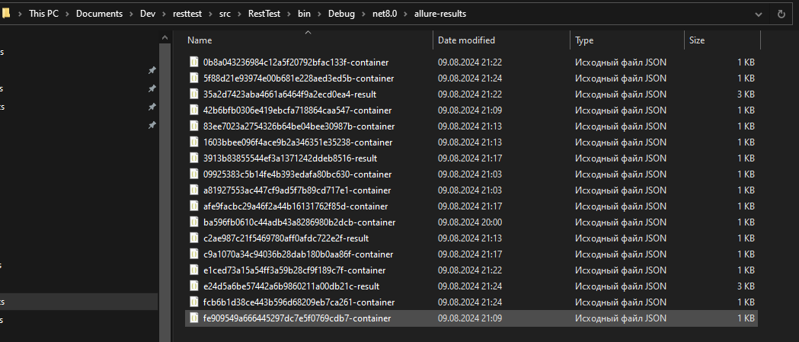

# RestTest

## Структура проекта
- Gems.TestInfrastructure.RestTest – основная библиотека, содержит все необходимое для запуска тестов
- Gems.TestInfrastructure.RestTest.UnitTests – юнит тесты для RestTest.Core

## Использование в проектах тестов
Допустим у нас есть готовый проект NUnit. Добавляем в него папки:
- Resources
- QA  

В папку Resources/QA будем складывать наши интеграционные тесты с расширением json. Файлы должны быть помечены как Copy if newer.
Добавляем юнит-тест:

```c#
[Test]
public async Task RunQA()
{
    await QA.RunAsync(new QAOptions()
    {
        Path = "Resources/QA",
        Recursive = true,
        HttpClient = application.HttpClient,
        Allure = new AllureOptions()
        {
            CleanupResultDirectory = true,
        },
    });
}
```


Здесь application – экземпляр ITestApplication из библиотеки Gems.
Данный код будет всякий раз запускать все файлы тестов из папки Resources/QA. Перед каждым запуском будет чиститься папка allure.

## Интеграция с Allure
Запуск тестов вызывает создание отчета Allure. Отчет формируется в папке allure-results в каталоге, где расположен исполняемый файл (текущий каталог).
Он представляет собой множество файлов json. Вот как это выглядит:


На текущий момент непонятно как это выглядит после импорта в test-ops.

## Создание файлов окружения
Файлы окружения можно использовать, чтобы хранить в них глобальные настройки, как, например, строки соединений.  
Пример файла окружения:
```json
{
  "variables": {
    "BaseUrl": "https://dummy.restapiexample.com"
  }
}
``` 

## Создание файлов теста
Файлы теста содержат запрос к сервису и проверки.  
Пример такого файла:
```json
{
  "tests": [
    {
      "name": "Create",
      "description": "Create employee",
      "author": "Igor S. Kurilov",
      "variables": {
        "methodName": "api/v1/create"
      },
      "request": {
        "method": "POST",
        "url": "{{BaseUrl}}/{{methodName}}",
        "body": {
          "name": "{{Fake.FullName()}}",
          "salary": "{{Fake.Amount()}}",
          "age": "{{Fake.Int(18, 55)}}"
        }
      },
      "asserts": [
        "Response.StatusCode==200",
        "Response.Body.Json.Error==null"
      ],
      "output": {
        "CreateTestResponse": "{{Response}}"
      }
    }
  ]
}
``` 

### Рассмотрим секции:
```json
"request": {
    "method": "POST",
    "url": "{{BaseUrl}}/{{methodName}}",
    "body": {
      "name": "{{Fake.FullName()}}",
      "salary": "{{Fake.Amount()}}",
      "age": "{{Fake.Int(18, 55)}}"
    }
}
```

#### Секция variables 
содержит переменные:
```json
"variables": {
  "methodName": "api/v1/create"
}
```

Значения переменных могут быть заданы как выражения. Значения переменных вычисляются перед запуском запроса. 

#### Секция templates
содержит шаблоны:
```json
"templates": {
    "UserTemplate": {
        "name": "{{Fake.UserName()}}",
        "password": "{{Fake.Password()}}"
    }
}
```

Значения шаблонов вычисляются в момент их использования.  
Пример использования:
```json
"request": {
    "method": "PUT",
    "url": "{{BaseUrl}}/users",
    "body": {
        "users": ["{{UserTemplate}}", "{{UserTemplate}}", "{{UserTemplate}}"]
    }
}
```

Код из примера выше создаст запрос из 3х пользователей со случайным именем и паролем:
```json
{
    "users": [
        {
            "name": "user1",
            "password": "pass1"
        },
        {
            "name": "user2",
            "password": "pass2"
        },
        {
            "name": "user3",
            "password": "pass3"
        }
    ]
}
```

#### Секция request
содержит описание запроса:
- method – HTTP метод
- url – адрес, лучше, если это будет относительный адрес
- body – (необязательно) объект, который передается в методах POST/PUT

#### Секция asserts 
содержит список проверок. Каждая проверка представляет из себя выражение, которое должно вернуть true
```json
"asserts": [
    "Response.StatusCode==200",
    "Response.Body.Json.Error==null"
]
```

#### Секция output
содержит переменные, которые могут хранить результат теста. Их можно будет использовать в следующем тесте
```json
"output": {
    "LastResponse": "{{Response}}"
}
```
### Встроенные переменные:
- Fake – для генерации данных запроса. См. https://gitlab.hoff.ru/axdev/libraries/resttest/-/blob/master/src/RestTest.Core/Library/FakerLibrary.cs
- Assert, Is – для использования в проверках. См.
- https://gitlab.hoff.ru/axdev/libraries/resttest/-/blob/master/src/RestTest.Core/Asserts/AssertLibrary.cs 
- https://gitlab.hoff.ru/axdev/libraries/resttest/-/blob/master/src/RestTest.Core/Asserts/AssertIsLibrary.cs 
- Response – доступна после выполнения первого запроса. Содержит результат   

### Структура Response:
- Body
- Text – (string) текстовое представление тела ответа
- Json – (JObject) объектное представление объекта
- StatusCode – (int) HTTP- статус запроса
- Headers – (Dictionary<string, IEnumerable<string>>) – заголовки ответа

### Выражения  
Все поля файла теста могут быть заданы в виде выражений. Выражения заключаются в двойные фигурные скобки. Если в значении узла json содержатся несколько выражений или выражения будут перемешаны с текстом, то итоговый узел будет иметь значение типа строка:  
- "stringParam": "Name {{Fake.FullName()}}, Age {{Fake.Age()}}" // string

Если выражение является единственным, то узел будет иметь тип в зависимости от результата вычисления  
- "dtParam": "{{DateTime.Now}}" // DateTime
- "intParam": "{{1 + 2}}" // int
- "doubleParam": "{{Fake.Amount()}}" // double
